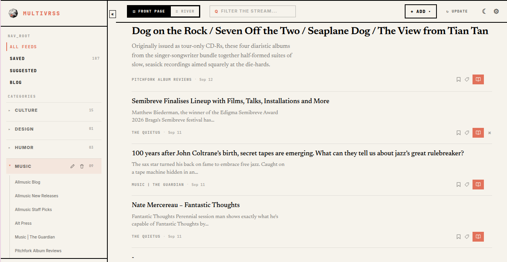
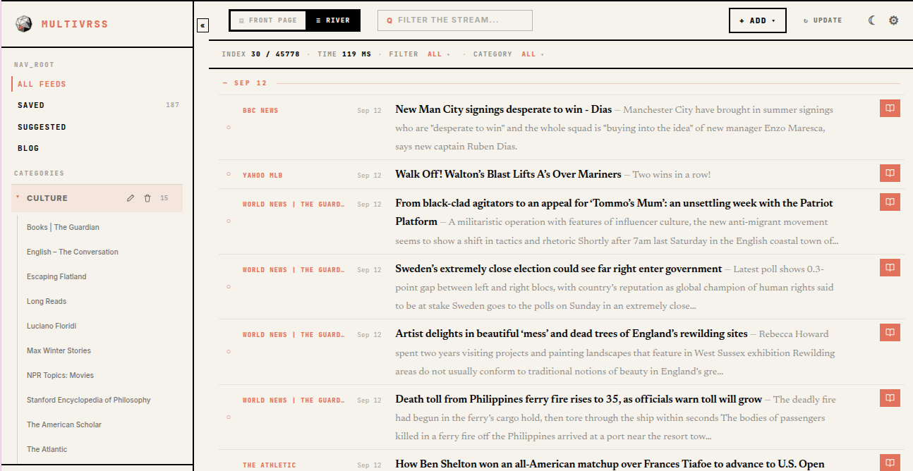
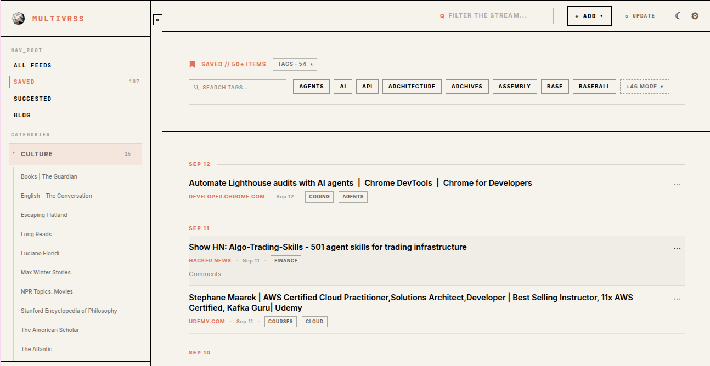
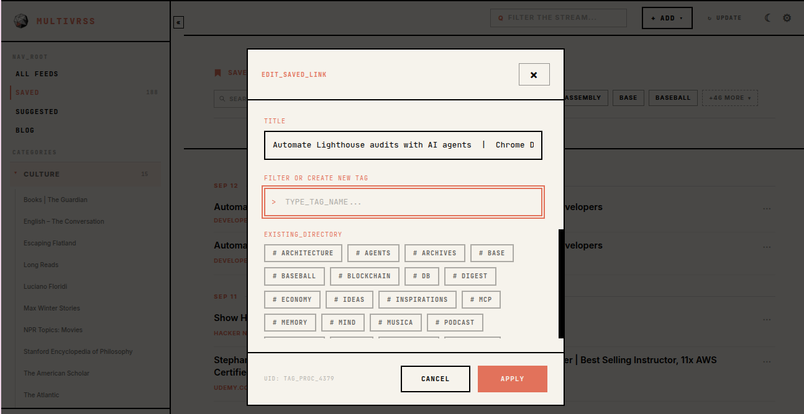

# MultivRSS

MultivRSS exists because Google Reader and Pocket don't. Both got shut down and I wanted them back, in one single product: an **RSS aggregator** and a **reading list** in a calm, minimal dashboard containing just **the feeds you follow** and **the links you save**. I wanted a place to gather, organize and consume the content I find on the internet and this is exactly it. You can read a [short manifesto](https://multivrss.com/en/blog/20260725_why-the-internet-doesnt-love-me-back) if you want.

[](./LICENSE)
&nbsp;[Changelog](./CHANGELOG.md) · [Roadmap](./ROADMAP.md) · [Self-hosting](./SELF_HOSTING.md)

## Try it

- **Hosted:** [multivrss.com](https://multivrss.com), free, no setup.
- **Self-hosted:** run your own instance with Docker, see
  [Self-hosting](#self-hosting) below.

> This repository is public because I wanted MultivRSS to be genuinely open
> source. Bug reports are welcome via [Issues](https://github.com/trnqeu/multivrss/issues);
> it does not accept external pull requests, since I don't have the time to
> review and maintain them on an ongoing basis. See [CONTRIBUTING.md](./CONTRIBUTING.md).

## Screenshots

|  |  |
|---|---|
|  |  |
|  |  |

## Features

**Feeds**
- Subscribe by URL, organize sources into categories, sort and collapse them
  in the sidebar.
- Background sync in a **separate worker process** (BullMQ + Redis): per-feed
  jobs with retry and exponential backoff, a per-domain concurrency limit,
  feed-`ttl`/`Cache-Control` awareness, and priority for never-synced feeds.
- YouTube channels work as feed sources.
- Every feed URL is treated as untrusted: DNS + private-IP checks guard
  against SSRF before anything is fetched.

**Reading**
- Read / unread tracking, a per-source-affinity "For You" strip on the home
  page, and a daily edition with a finishable progress count.
- **Reader Mode**, full article text extracted in-app (Mozilla Readability +
  `sanitize-html` allowlist, Redis-cached), with copy-to-clipboard and
  export-as-Markdown. Works for both feed items and saved external links.
- "Paper" light theme and a contrast-checked dark theme, persisted locally.

**Reading list**
- Save any feed item or any external URL (Pocket / Instapaper style), with
  the page title and description fetched automatically.
- Tag saved links and feed items; filter the list by tag.
- Unsaved feed items are purged ~90 days after they drop out of their source
  feed; saved items are kept indefinitely.

**Search**
- Native PostgreSQL full-text search (`tsvector` / GIN, no separate search
  service) across feed items **and** saved links in a single bar.
- Filter by category, time range, source, and read status.

**Discovery & import/export**
- A curated public suggested-feeds directory with search, category filters,
  and bulk-add.
- Import feed sources from OPML or CSV; import saved links from Pocket,
  Instapaper, or generic CSV. Export either as CSV.

**Platform**
- Installable PWA with a share-target endpoint (share links straight into the
  app from mobile).
- Personal API keys for external tools (gated behind a Premium flag),
  documented by an interactive OpenAPI reference at `/docs`.
- Localized public marketing site (English / Italian).
- Sign in with GitHub, Google, or email + password (with email verification
  and password reset). Self-service account deletion.

## Tech stack

Next.js 16 (App Router, React Server Components, Server Actions) · React 19 ·
TypeScript 5 · Tailwind CSS 4 · PostgreSQL 16 · Prisma 7 (`@prisma/adapter-pg`) ·
NextAuth v4 (JWT) · BullMQ + Redis · Docker · Sentry.

Full-text search is native Postgres (`tsvector` generated columns, GIN
indexes) rather than a separate search service, a deliberate choice to keep
the production footprint small.

## Running locally

Prerequisites: Node.js 24+, Docker.

```bash
git clone git@github.com:trnqeu/multivrss.git
cd multivrss
npm install
npx prisma generate           # generate the Prisma client, required, npm install alone doesn't do it
cp .env.example .env          # fill in the values, see comments in the file
docker compose up -d          # Postgres (5435) + Redis (6379)
npx prisma migrate deploy     # apply the existing schema
npm run dev                   # http://localhost:3002
npm run worker                # in a second terminal, feeds don't sync without it
```

`scripts/create-test-users.ts` creates verified users directly in the
database so you can log in without email verification:

```bash
npx tsx --tsconfig tsconfig.test.json scripts/create-test-users.ts 1 MyPass1!
```

It refuses to run against anything but `localhost`. Full usage is in
[SELF_HOSTING.md](./SELF_HOSTING.md#8-first-login).

### Common commands

```bash
npm run dev      # dev server (port 3002)
npm run build    # production build
npm run lint     # ESLint
npm run test     # Vitest unit tests
npm run worker   # background feed-sync worker
```

## Self-hosting

Running a long-lived instance for personal use takes a few more steps than
the quickstart: registering OAuth apps, generating secrets, keeping the
worker process alive, and (optionally) putting the app behind your own
domain. The full walkthrough, plus updates and troubleshooting, is in
[SELF_HOSTING.md](./SELF_HOSTING.md).

## Project layout

Next.js 16 App Router under `src/app`. A few conventions worth knowing before
reading the code: `src/proxy.ts` is the request-proxy convention that
replaced `middleware.ts`; `next.config.ts` sets `cacheComponents: true`, so
caching follows the Cache Components model (`"use cache"` for cacheable
output, `connection()` to defer to request time); Server Components are the
default and Server Actions handle mutations.

| Path | Access | What it is |
|------|--------|------------|
| `/`, `/en`, `/it` | Public | Marketing site: landing, blog, guide, suggested sources, tips |
| `/login`, `/register`, `/forgot-password` | Public | Auth flows |
| `/docs` | Public | Interactive API reference (OpenAPI via Scalar) |
| `/u/{username}` | Owner only | Private dashboard: all feeds, inline full-text search (`?q=`) |
| `/u/{username}/category/{slug}`, `/source/{slug}` | Owner only | Category- / source-filtered feed |
| `/u/{username}/saved` | Owner only | Reading list |
| `/u/{username}/read/{itemId}` | Owner only | Reader Mode |
| `/u/{username}/settings/*` | Owner only | Account, API keys, import/export |

Every route under `/u/{username}/` sits behind a layout that enforces
authentication **and** that the URL's `{username}` matches the session, no
other user's dashboard is reachable by editing the URL.

The full route-by-route breakdown and every architectural convention live in
[CLAUDE.md](./CLAUDE.md) (written as coding-agent guidance, but equally
useful as a technical reference).

## Deployment & CI/CD

Push to `dev` deploys to staging; push to `main` deploys to production; pull
requests run the quality gate only (`tsc --noEmit`, lint, tests,
`npm audit`). Deploys build a multi-stage Docker image, push it to GHCR, then
SSH into the server to run migrations and recreate the containers, with a
health-check-gated automatic rollback.

The full breakdown of Dockerfile stages, the deploy script, and production
container topology lives in [`.github/workflows/`](./.github/workflows/) and
[`docker-compose.prod.yml`](./docker-compose.prod.yml). Required secrets live
in GitHub Environments, never in the repo.

## Roadmap

A few of the larger things on the list:

- Browser extension: detect feeds on the current page, save articles (the
  REST API it needs already exists).
- All-in-one `docker compose up` that starts the app alongside Postgres and
  Redis.
- WCAG 2.1 AA accessibility pass.
- A Postgres-native redesign of the "similar items" recommendation engine.
- Full backup export / restore (feeds, categories, saved links, tags, read
  state) as a single archive.

The full list is in [ROADMAP.md](./ROADMAP.md).

## Contributing

Bug reports and feature ideas are welcome as
[Issues](https://github.com/trnqeu/multivrss/issues). This repository does
**not** accept external pull requests: it is maintained solo. Forking under
the MIT License is welcome if you want to take the codebase in your own
direction. See [CONTRIBUTING.md](./CONTRIBUTING.md).

## License

MIT, see [LICENSE](./LICENSE).
