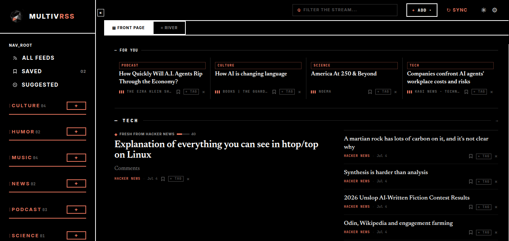

# Handoff: Hero — sostituzione icona gigante con screenshot reale dell'app

## Overview
La hero della home MultivRSS attualmente mostra, nella colonna destra, il **mark gigante** (icosaedro + onde) con una didascalia tecnica. Il mark "galleggia" — non comunica cosa fa il prodotto — e su mobile diventa un'icona enorme sospesa sotto la CTA.

Questa modifica sostituisce quel mark con uno **screenshot reale dell'app** ("reading room") incorniciato in una finestra con barra a semaforo. Mostra il prodotto invece di un logo decorativo.

## About the Design Files
I file in questo bundle sono **reference di design create in HTML** — prototipi che mostrano l'aspetto e il comportamento voluti, non codice di produzione da copiare tal quale. Il compito è **ricreare questo design nell'ambiente del codebase esistente** (React/Astro/Vue/ecc.) usando i pattern già in uso. La modifica è **chirurgica**: tocca solo la colonna destra della hero, lasciando invariati nav, testo/CTA a sinistra, e tutte le sezioni sotto.

## Fidelity
**High-fidelity.** Colori, tipografia, spaziature e bordi sono definitivi. Ricrea l'UI pixel-perfect con le librerie/pattern del codebase.

## La modifica (in breve)
Nel markup attuale della hero, la colonna destra è:

```html
<div class="hero-art">
  
  <div class="stamp">MARK_v2.1 · ICOSAHEDRON + WAVES · STABLE</div>
</div>
```

Va sostituita con una **finestra che contiene lo screenshot reale**:

```html
<div class="shot">
  <div class="bar">
    <span class="dot"></span>
    <span class="dot dot--terra"></span>
    <span class="dot"></span>
    <span class="t">multivrss — reading room</span>
  </div>
  
</div>
```

### Regola tema-invertito (IMPORTANTE)
Lo screenshot mostrato è **opposto** al tema della pagina, per contrasto:
- Home in tema **light** → usa lo screenshot **dark** (`app-shot-dark.png`)
- Home in tema **dark** → usa lo screenshot **light** (`app-shot-light.png`)

Se il sito supporta il toggle light/dark, scambia il `src` (o due `` con visibilità gestita da CSS/`prefers-color-scheme`).

## Layout della hero
- Contenitore `.hero-grid`: CSS Grid, `grid-template-columns: 1.2fr 1fr`, `gap: 56px`, `align-items: center`, `max-width: 1200px`, centrato, `margin: 0 auto`.
- **Sinistra (invariata):** kicker mono + `<h1>` + lede + CTA.
- **Destra (nuova):** la finestra `.shot`.

### Componente `.shot` (la finestra)
- `border: 2px solid #000;`
- `background: #000;`
- `box-shadow: 14px 14px 0 rgba(0,0,0,.12);` — ombra dura offset, niente blur (coerente col resto del sito).
- **Nessun** border-radius (angoli vivi, come tutto il design system).

Barra `.shot .bar`:
- `display:flex; align-items:center; gap:8px; padding:11px 14px;`
- `border-bottom:2px solid #000; background:#fff;`
- 3 pallini `.dot`: `width:10px; height:10px; border-radius:50%; border:1.5px solid #000;` — il **secondo** è terracotta pieno (`background:#E2725B; border-color:#E2725B;`).
- Etichetta `.t`: JetBrains Mono, `11px`, `700`, `letter-spacing:.1em`, colore `rgba(0,0,0,.55)`.

Immagine `.shot img`:
- `display:block; width:100%; height:auto;`
- Gli screenshot sono **1359×645px** (ratio ~2.107:1).

## Responsive / mobile
La `.hero-grid` passa a **colonna singola** sotto ~768px: il blocco testo/CTA sopra, la finestra `.shot` sotto, a piena larghezza. La finestra si impila in modo naturale — nessuna icona sospesa. Considera un piccolo margine superiore (`margin-top: 32px`) tra CTA e finestra su mobile.

## Design Tokens
- `--black: #000`
- `--paper: #f6f3ec` (sfondo home light)
- `--terra: #E2725B` (accento terracotta)
- `--ink-2: rgba(0,0,0,.55)` (testo secondario)
- `--ink-3: rgba(0,0,0,.30)` (testo terziario / label spente)
- `--ink-line: rgba(0,0,0,.12)` (linee sottili)
- Ombra dura: `14px 14px 0 rgba(0,0,0,.12)`
- Bordi: `2px solid #000`, angoli vivi (no radius) ovunque tranne i pallini
- Font testo/titoli: **Inter** (400–900)
- Font mono/label: **JetBrains Mono** (400–700)

## Assets
Nella cartella `assets/` di questo bundle:
- `app-shot-dark.png` — screenshot reale dell'app in tema **dark** (1359×645). Usato sulla home **light**.
- `app-shot-light.png` — screenshot reale dell'app in tema **light** (1359×645). Usato sulla home **dark**.
- `multivrss-ico.png` — icona brand per la nav (invariata).

Il vecchio `multivrss-mark-tight.png` **non serve più** nella hero (può restare usato altrove).

## Files
- `Hero Options.html` — canvas con le 3 direzioni esplorate; la **Direzione B** è quella approvata e già aggiornata con lo screenshot reale.
- `Home with Two Things.html` — la home completa in cui va applicata la modifica (contiene la hero attuale con `.hero-art` da sostituire).
